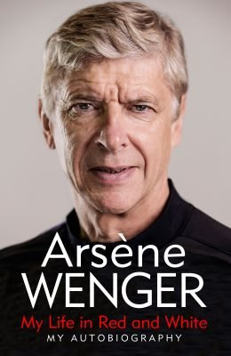

# Arsene Wenger - My life in red and white

## Synopsis
For the very first time, world-renowned and revolutionary football manager Arsène Wenger tells his own story. He opens up about his life, sharing principles for success on and off the field with lessons on leadership, and vivid tales of his 22 years managing Arsenal to unprecedented success.

There, Wenger won multiple Premier League championships and a record number of FA C ups, and his teams included the Invincibles of 2003-2004 and a record-breaking undefeated 49-match run. He popularised an attacking approach and belief that the game should be entertaining but he also changed the attitudes of British football fans towards players' diet, fitness and coaching methods - and towards foreign managers too.

In My Life in Red and White, Wenger charts his extraordinary career, including his rise in France and Japan where he managed Nancy, Monaco and Nagoya Grampus Eight (clubs that also play in red-and-white, like Arsenal!) to his 22 years at the helm of an internationally renowned club from 1996 onwards. He describes the unrest that led to his resignation in 2018, and his current role as Chief of Global Football Development for FIFA.

He offers studious reflections on the game and his groundbreaking approach to motivation, mindset, fitness and football that was often beautiful to watch. This book is a must-read for not only Arsenal fans but football fans everywhere, for management and business leaders, and anyone seeking the tools for success in work and life. It will illuminate the mystique surrounding one of the most revered and successful manager's life story, strategy and vision in the world's most popular sport

## Quotes and notes
- Notes are presented as a bullet list

> Quotes are presented as a Markdown quote
They may have some personal notes after them, like this. This is not part of the book, just my thoughts about the quote

Consecutive quotes/notes don't have to be related at all, they may be pages apart

:star: Personal favourites are marked with a star emoji

## Prologue
> For thirty-five years, I lived like a top athlete, obsessed by my passion. I didn't go to the theatre or the cinema; I neglected those around me. For thirty-five years, I didn't miss a single match, a single cup, a single championship, which meant living with an iron discipline, and I continue to live like that today: I get up at 5:30 a.m., do my exercises, train, eat and drink the way my former players did. I no longer know if this is a choice or a habit hat imprisons me. But it's the only way for me to live. Without it, I think I would be unhappy. If happiness is liking the life one lives, I can say I have been happy, and still am.
About how being a top-level professional often implies a huge amount of work and sacrifice in the personal live. It's a trade-off you have to make if you want to consistently be at that level. However at the same time, it's also important to consider that you don't have to hate it just because it's work: the key is to understand if it makes you happy, and if that's the case, then enjoy it

## 1 - The child who dreamt about football
> Having no coach, when young, was also invaluable for allowing us to develop a game based on taking the initiative
Good point, sometimes is good to be on your own because then you need to do things for yourself if you want to make progress

> Technique does matter [...], but it's not enough on its own: not being afraid, knowing how to take the initiative, being resilient, reliable, showing solidarity, being a bit crazy, having one hell of a passion

> I didn't want to suffer from my mental and physical inadequacies, I wanted rather to understand them, and overcome them

## 2 - The young man who played football
> You learnt by throwing yourself into it, by forgetting to be afraid
In this case he speaks about learning to dance with a girl, but it's a lesson that can apply to a lot of things in life

> I didn't want fear - the fear of being judged by others and the fear of consequences - to paralyse me on the pitch, to prevent me from moving forwards

> At first I was nothing special, I struggled to carve out a place for myself, but to his credit, Max [his football coach] persisted. He kept me in the team. He played me. It was a lesson: you must give players time.

> At each new club, I needed to relearn, to prove myself once again, to overcome my inadequacies.

> :star: Life is a journey punctuated with afflictions that helps us progress with our fears, our inner moods and emotions