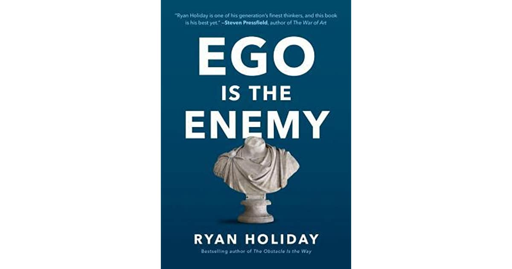

# Ego is the enemy

# Synopsis
"While the history books are filled with tales of obsessive, visionary geniuses who remade the world in their image with sheer, almost irrational force, I’ve found that history is also made by individuals who fought their egos at every turn, who eschewed the spotlight, and who put their higher goals above their desire for recognition." – from the Prologue

Many of us insist the main impediment to a full, successful life is the outside world. In fact, the most common enemy lies within: our ego. Early in our careers, it impedes learning and the cultivation of talent. With success, it can blind us to our faults and sow future problems. In failure, it magnifies each blow and makes recovery more difficult. At every stage, ego holds us back.

The Ego is the Enemy draws on a vast array of stories and examples, from literature to philosophy to history. We meet fascinating figures like Howard Hughes, Katharine Graham, Bill Belichick, and Eleanor Roosevelt, all of whom reached the highest levels of power and success by conquering their own egos. Their strategies and tactics can be ours as well.

But why should we bother fighting ego in an era that glorifies social media, reality TV, and other forms of shameless self-promotion?  Armed with the lessons in this book, as Holiday writes, "you will be less invested in the story you tell about your own specialness, and as a result, you will be liberated to accomplish the world-changing work you’ve set out to achieve."

# Quotes and notes

> Quotes are presented as a Markdown quote

They may have some personal notes after them, like this. This is not part of the book, just my thoughts about the quote

Consecutive quotes/notes don't have to be related at all, they may be pages apart

:star: Personal favourites are marked with a star emoji

## Introduction

As a general note: the intro is really good overall, so if you can access it it's definitely worth the read

> The first principle is that you must not fool yourself - and you are the easiest person to fool
Quote from Richard Feynman, opening the chapter

> Precisely what makes us so promising as thinkers, doers, creatives, and entrepeneurs, what drives us to the top of those fields, makes us vulnerable to this darker side of the psyche

> If you start believing in your greatness, it is the death of your creativity

## Aspire

> "Talent is only the starting point". The question is, will you be able to make the most of it? Or will you be your own enemy?

Apart from the previous quote, the part of the chapter between the middle of the page where it's located and the end of the chapter is very good, worth reading it

## Talk, talk, talk

> Those who know do not speak. Those who speak do not know

Quote by Lao Tzu opening the chapter

> Writing, like so many creative acts, is hard. [You'll be] mad at the material because it doesn't seem good enough and _you_ don't seem good enough. Many valuable endeavors we undertake are painfully difficult

> :star: "Never give reasons for what you think or do until you must. Maybe, after a while, a better reason will pop into your head"

> Research shows that while goal visualization is important, after a certain point our mind begins to confuse it with actual progress. The same goes for verbalization. Even talking aloud to ourselves while we work through difficult problems has been shown to significantly decrease insight and breakthroughs. After spending so much time thinking, explaining, and talking about a task, we start to feel that we've gotten closer to achieving it. Or worse, when things get tough, we feel we can toss the whole project aside because we've given it our best try, although of course we haven't

> The greatest work and art comes from _wrestling_ with the void, facing it instead of scrambling to make it go away

## To be or to do?

> Impressing people is utterly different from being truly impressive

> It is not "Who do I want to be in life?", but "What is it that I want to accomplish in life?"

> Think about this the next time you face that choice: Do I _need_ this? Or is it really about ego? Are you ready to make the right decision? Or do the prizes still glitter off in the distance? To be or to do

## Become a student
> :star: A system [...] called Plus, Minus and Equal. Each fighter [...] needs to have someone better that they can learn from, someone lesser who they can teach, and someone equal that they can challenge themselves against

A system to continuously learn and become better. It was invented by Frank Shamrock, an MMA fighter.

> "It is impossible to learn that which one thinks one already knows"

## Don't be passionate
> :star: When we are young, we feel so intensely that it seems wrong to take it slow. This is our inability to see that burning ourselves out or blowing ourselves up isn't going to hurry the journey along

Incredibly important, even if sometimes is hard to learn. I feel completely represented on this quote, because on my first jobs I was always trying to make things happen fast and rush them. However, in the end there are things that we can only learn with time, and not having the **patience** to wait for them to happen will only lead to burnout

> :star: Be lesser, do more

Don't focus on being the best, achieving everything yourself, being successful. Instead, focus on _doing_ things, even if you are not going to get any benefit from them directly: coming up with ideas to hand over to your boss, find what nobody else wants to do and do it, find inefficiencies and patching them...

In the end, just by exposing yourself to problems or things to do, you'll learn a lot and that will make you better

This reminded me of one of my favourite essays by Paul Graham, ["Keep your identity small"](http://www.paulgraham.com/identity.html), about how much it will help you avoid biases when you stop thinking about things as "part of your identity" and instead think of them as something you do (e.g. "Being a developer that uses Python" instead of "Being a Python developer")

## Get out of your own head

> A person who thinks all the time has nothing to think about except thoughts, so he loses touch with reality and lives in a world of illusions"

Quote by Alan Watts, opening the chapter

> :star: [...] "imaginary audience" [...]

> Living clearly and presently takes courage. Don't live in the haze of the abstract, live with the tangible and real, even if - especially if - it's uncomfortable. [...] There's no one to perform for. There is just work to be done and lessons to be learned, in all that is around us.

A really interesting concept, referencing those situations when we are afraid of doing something because of the embarassement if we do it incorrectly. However, most of the time there's no one really caring about it, and it's only an "imaginary audience" what we're afraid about.

## The danger of early pride

> :star: "Even the tallest mountains have animals that, when they stand on it, are higher than the mountain"

## Work, work, work

> :star: There is no end zone. To think of a number is to live in a conditional future - To get where we want to go isn't about brilliance, but continual effort
