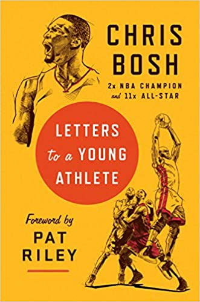

# Letters to a young athlete

## Synopsis
**A legendary NBA player shares his remarkable story, infused with hard-earned wisdom about the journey to self-mastery from a life at the highest level of professional sports**

Chris Bosh, NBA Hall of Famer, eleven-time All-Star, two-time NBA champion, Olympic gold medalist, and the league’s Global Ambassador, had his playing days cut short at their prime by a freak medical condition. His extraordinary career ended not at a time of his choosing but “in a doctor’s office in the middle of the afternoon.” Forced to reckon with how to find meaning to carry forward, he found himself looking back over his path, from a teenager in Dallas who balanced basketball with the high school robotics club to the pinnacle of the NBA and beyond.
 
Reflecting on all he learned from a long list of basketball legends, from LeBron and Kobe to Pat Riley and Coach K, he saw that his important lessons weren’t about basketball so much as the inner game of success—right attitude, right commitment, right flow within a team. Now he shares that journey, giving us a fascinating view from the inside of what greatness feels like and what it takes, formulated as a series of letters to younger people coming up and to all wisdom seekers. A timeless gift for anyone in pursuit of excellence, Letters to a Young Athlete offers a proven path for taming your inner voice and making it your ally, through the challenges of failure and the challenges of success alike.

## Quotes and notes

> Quotes are presented as a Markdown quote

They may have some personal notes after them, like this. This is not part of the book, just my thoughts about the quote

Consecutive quotes/notes don't have to be related at all, they may be pages apart

:star: Personal favourites are marked with a star emoji

## Introduction

> :star: No matter what kind of talent you've been blessed with, you still have to answer the same question. What do you want to do with this? Where are you going, and how can you use what you've been given to get there? [...] Part of being wise it's accepting you don't have all the answers right now. Try to love the questions themselves. The point is, to live everything. Live the questions now. Perhaps then, some day far in the future, you will gradually, without even noticing it, live your way into the answer. [...] You have to live everything [...] If you don't stop to live what you're doing, you're missing the biggest thing [...] We all have that capacity to stop and experience the joy of what we're doing

## Chapter 1 - When you ain't nothing but tired

> What our coach wanted us to get better at was playing well even when we were exhausted; getting good at hanging on to our desire to continue competing

> How you do anything is how you do everything. If you make excuses or take shortcuts in one part of your life or your game, it's very hard not to do it everywhere else

> It's all about learning to distrust your limits: when you think you've hit your limit, you're only at about 40% of your capacity

> :star: Imagine if we put a little less in practice. Imagine if we coasted just a little bit more. Imagine we had a little less in the tank when it counted. "It would've been a shame for that to cost us a championship"

> :star: No amount of work can make you taller. You can't make your hands bigger. You can work on your reaction time and reflexes, but to a certain extent they're just hardwired. But grit? Dedication? That's on you. That's up to you

> Building endurance is hard. I have always hated running. Hated it. So I was scared. Scared of the exhaustion. Scared of not being able to catch my breath. Scared of the burning in my muscles [...] And yet I kept doing it [...] Your legs are gonna burn, your chest is gonna burn. You just have to get used to it. [...] That pain is temporary; championships are forever.

> :star: And in life, it's the same. Life doesn't wait to see if you're rested and ready before throwing the biggest tests at you. It throws those tests at you whenever it feels like it

## 2 - You have to find your why (and it can't be fame or money)

I found this chapter in general very interesting because it reminded me of one of the topics I studied this year in Psychology, about ["Intrinsic vs Extrinsic Motivation"](https://github.com/AlexGascon/psicologia-uned/tree/main/1a-psicologia-de-la-motivacion/08-motivacion-y-cognicion). TLDR, the topic explains that the motivation that comes from inside (like the one you have when you enjoy an activity or find it interesting), is way more effective that the one you get from external sources, like money or success. Multiple studies link extrinsic motivation with higher levels of anxiety or depression.

So, if most of what Chris Bosh says in this chapter is just his personal experience, multiple things have pretty solid evidence backing it in the field of Psychology. It's definitely worth taking it seriously

> Listen to your coach when he tells you to run suicides. But don't listen when he or she tries to tell you what this game means to you. You gotta figure that out yourself.

> You need to go deeper
> "I'm doing this because I want to win basketball games"
> Why?
> "Because I want to win a championship"
> Why is that important to you?
> "Because then people will look up to me"
> Why is that important to you?
> [...]

I really liked this paragraph because it reminded me of the [5 Why's rule](https://wa.aws.amazon.com/wellarchitected/2020-07-02T19-33-23/wat.concept.fivewhys.en.html) that we use at Amazon during incident analysis. You can't just be satisfied with the obvious reason, you need to go deep into it and carefully analyse what brought you there.

> One of the more common whys I see [...] is to prove to the world that you matter. If you have self-steem issues, the roar of the crowd can be a kind of substitute love

> :star: You're growing and changing as you play the game, and it's fine for your why to change as you grow. [...] The key is to never invest your why in something external that can be taken away by a power beyond your control [...] It's got to connect to your soul. It's got to connect to something bigger than yourself.

## 3 - The gift of hunger

> You can tell which players have elite hunger, and which don't. The ones that do are all over the court, rebounding, going after every loose ball, playing until the whistle every time. They're playing hard even when the game is out of reach or put away, whether they're down 20 or up 20

> :star: After our first championship with the Heat, a friend told me, "Man, anybody can do it once. You gotta do it twice". Finding a reason for hunger when you have every reason to feel full - that's what separates good from great

> What keeps Elon Musk at it, starting new companies? It's not the financial rewards. It's just the joy of getting better, of wanting to beat your own personal best every time you lace up your shoes or step into your office

> :star: If you find ways to develop your gift of hunger, if you have teammates and coaches who inspire you to keep pushing, you find that hunger can become part of your life. It's like a virtuous cycle - the more work you put in, the hungrier you get, the harder you work, the more success you see, the hungrier you get

This quote made me think about the importance of a good environment - If the people around you gets satisfied with "good", it's easy to lower your standards up to that level. Instead, if you see everyone around you continuously doing their best and trying as hard as their can to keep pushing, you feel inspired to do so too. It gives you an extra motivation to try to get continuously better

> Get **too** hungry and you can end up eating yourself - obsessing over games that ended years ago, beating yourself up over mistakes from the past, risking your health and your body when you need time to recover and heal. And just as I've seen talented players without enough hunger to excel, I've seen players hungry for the wrong things - for stats but not for winning, for ego gratification but not team success, for money but not joy of playing the game. I've talked a lot in this letter about staying hungry. But remember, **what** you're hungry for matters, too. That's why letting yourself be motivated and inspired by coaches and teammates makes such a difference

Good reminder that hunger can also become a problem - You need to make sure it's not making you obsess over things you cannot control, or over things that just feed your ego. It's important to let hunger get you closer to what **really** matters to you.

## 4 - Cultivating the mind

> Getting smart is not an accident, just like getting strong isn't one either. Richard Sherman put in the work on his mind and his body. So should you.

> Growing up, when you watch your heroes on TV, it looks like they never have doubts or self-criticism. [...] But when you try to follow in their footsteps, you realize there's no way to succeed in this without facing down your doubts.

> Sometimes the biggest reserves of mental toughness come from way outside the game - whatever your game is. Winston Churchill is probably up there with the most mentally tough people who ever lives. And when he wasn't fighting nazis, he was painting. He even wrote a book about it. I don't think he loved painting because he was into some vague ideal of being "well-rounded". It was because, in real life-or-death situations, he needed the perspective and calm that comes with taking a big step back.
> You can tell I'm partial to out-of-the-box learning. Yeah, I think it's cool that Damian Lillard has put out some rap albums, but I think it's also cool that NFL offensive lineman John Urschel began a math PhD program at MIT while he was still playing, and that nose tackle Steve McLendon has been taking ballet since he was in college. He said that ballet "is harder than anything else I do" - and this comes from a guy who lines up across 325-pound (150 kg) offensive linemen every week. But ballet also gave him the flexibility and body control to excel at his day job [...] And it's not just athletes, either. Mae Jemison, the first black woman in space, also studied and practiced dance.

> I think that some of the most successful athletes get the most value from exposure to ideas outside their field of expertise. The book Candace Parker (WNBA player) credits for her mental toughness is _Chop Wood, Carry Water_. Tom Brady likes _The Inner Game of Tennis_, which obviously isn't about football at all. I've gotten real athletic benefits from books about ancient philosophy, martial arts, science, psychology, and so many other topics.

> No matter how high you climb in your sport, you don't want to be an old athlete with nothing to think about or talk about but memories of the glory days. You want to keep learning and growing until the day you day. And so you have to start now.

## 5 - Communication is key

> Because no matter how smart you are, and no matter how good your court vision is, there is more happening on the court at any one time than any one person can take in

> "One must speak to the soul", Napoleon said of the speeches he made to his men before they charged the enemy. "It's the only way to electrify the men"

> :star: A leader sees the challenge ahead, knows what the members of the team need to do to meet the challenge, and knows the words or the symbols or the images that will get them where they need to be. Knowing _that_ doesn't just take charisma: It takes a huge amount of insight into the team members. What kinds of words motivate them, and what kind of words turn them off? How far can they be pushed? Is this a time to pick up their spirits, or a time to get them to ratchet up the intensity?

This is often overlooked, but to me it's incredibly important. What works wonderfully for someone might be useless for someone else; what makes a teammate get extra energy might break another one. It's the reminder that leadership is not about having a few strategies to communicate well or make good decisions, but to deeply understand your team and what they need at any given moment.

> :star: On all of the teams I've been on, I found that the more I communicated, the more my teammates communicated. It becomes part of your team identity. It's infectious.

Good habits propagate!

> :star: It's easier to keep communication open when things are going well. [...] It's harder - but much more important - to keep communication open when things _aren't_ going well.

> A good communicator knows that each teammate and each situation is unique - what works with one guy in a certain game scenario will backfire with another guy in a different scenario. We talked earlier about the importance of cultivating your mind. Part of that is learning to be a better psychologist - someone who understands your teammates' quirks, but also someone who has observed enough people that you can start picking out patterns.

> [...] He criticized issues and actions, not people. It's the simple difference between "I need reports on my desk on time" and "You're too lazy to get your reports in on time".

> :star: Listening is the other side of communication. It's about actually taking time to think about what you're being told, about taking enough time to be quiet that you can actually hear what others have to say. Listening is the underrated half of communication - there are tons of books about "Great Speeches of History" and probably not any about "Great Listeners of History"

## 6 - Sweep away your ego

> If you think you're as good as you can be, you're right. You won't get any better

> You go from being the best at your old level to the bottom of the heap (or, at beast, the middle of the pack) at the new level. How you respond to this sudden change in the level of play defines you. It's what separates the amateurs from the pros - literally.

> :star: That's the paradox of ego: if you want to be great, you need to be honest with yourself about all the ways in which you're not great yet.

> And I'm letting you know that the main thing that got me over the hump both times wasn't my height or my speed or any other physical gifts - it was the ability to keep my ego in check, to get my ass kicked in practice and say "Damn, I have a long way to go"

> The most powerful step to defeating it is learning to see it in the mirror. Once you realize the role the ego plays in holding you back, you've taken a huge step toward beating it.

> :star: What's the difference between ego and confidence?
> Ego is a liar. It tells you you're the greatest, regardless of what the results say - it always finds a way to spin those
> Confidence is belief in your ability, in the work you've put in, that's backed up by reality. Confidence is expecting good things to happen because you worked hard to make them happen

> Ego poisons success - confidence is necessary for success
