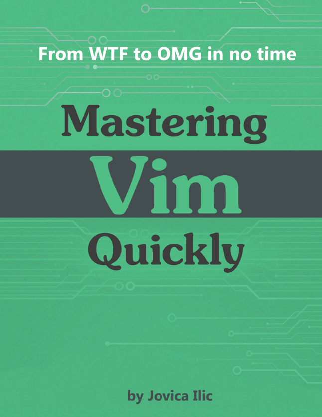

# Mastering Vim Quickly

## Introduction

Mastering Vim Quickly is a book from Jovica Ilic about the Vim text editor. It's structured as short chapters that present different Vim concepts in a way that makes it very easy to understand and to get familiar with it.

More information on https://jovicailic.org/mastering-vim-quickly/

## Chapter 5 - Vim Concepts
**Insert Normal mode**: It's like `Normal mode`, but it returns to `Insert mode` after executing a command. You can enter it by pressing `Ctrl-o` while on `Insert mode`

## Chapter 6 - Working with files
- `gf`: Opens a file whose filename is under the cursor
- `gx`: Opens the current link in your web browser
- `ZZ`: Equivalent to `:x`, but directly from your keyboard (`:x` closes a file and only writes if it has changed)
- `:r` or `:read`: Outputs the content of a file or command after the cursor
  - `:r file.txt` inserts file.txt below the cursor in the current buffer
  - `:r !ls` Inserts the output of `ls` below the cursor
  - `:r!sed -n 2,8p file.txt` inserts line 2 to 8 from the file below the cursor

Scrolling:
- `Ctrl-d`: Scroll down half page
- `Ctrl-u`: Scroll up half page
- `Ctrl-f`: Scroll down (**forwards**) full page
- `Ctrl-b`: Scroll up (**backwards**) full page

Jumping around:
- `{`: Beginning of the current paragraph
- `}`: End of the current paragraph
- `%`: Matching pair of `(), [], {}`
- `50%`: Go to the line at 50% of the file
- `:NUM`: Go to the line `NUM`
- `H`: Move cursor to the first (**highest**) line in the current window
- `L`: Same but to the last (**lowest**) line
- `M`: Same with the **middle** line

Searching:
- `*` / `#`: Searches the current word forward/backwards (exact match)
- `g*`/ `g#`: Searches the current word forward/backwards (without exact match, e.g. if the word is `roll` it will also match `scroll`)
- `Ctrl-o`: Returns to the previous position after searching
- `/ + hit Enter`: Repeats the last search

### File manager (netrw)
`netrw` is a built-in Vim plugin that allows to easily navigate files and directories. Most of the command contain `ex`, which is a shortcut of **ex**plore

- `:Ex`: Open current directory in the current window
- `:Sex`: Open with a horizontal split
- `:Vex`: Open with a vertical split
- `:Tex`: Open in a new tab
- `:Lex`: Open in a vertical split  to the left. Default opens to the right

You can add a directory to all those commands to make them open that directory, like `:Ex /home/alex/books/` or `:Vex /home/alex/books`

- `:40vs +Ex`: open a vertical split with a width of 40 columns

In a `netrw` window, press `i` to cycle through different views: **thin, long, wide and tree**

Operations with the files:
- `<Enter>`: Opens the file/directory
- `D`: Deletes. If you visually select multiple files, you can delete all of them at the same time
- `X`: Executes
- `R`: Renames
- `%`: Creates a new file

Set netrw split width: use the `netrw_winsize` option. For example, this will set it to a 20% of the Vim window: `let g:netrw_winsize = 20`
