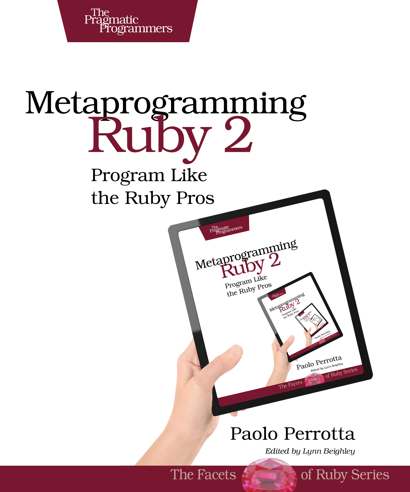

# Metaprogramming Ruby
Write powerful Ruby code that is easy to maintain and change. With
metaprogramming, you can produce elegant, clean, and beautiful programs. Once
the domain of expert Rubyists, metaprogramming is now accessible to programmers
of all levels. This thoroughly revised and updated second edition of the
bestselling Metaprogramming Ruby explains metaprogramming in a down-to-earth
style and arms you with a practical toolbox that will help you write your best
Ruby code ever.

  

