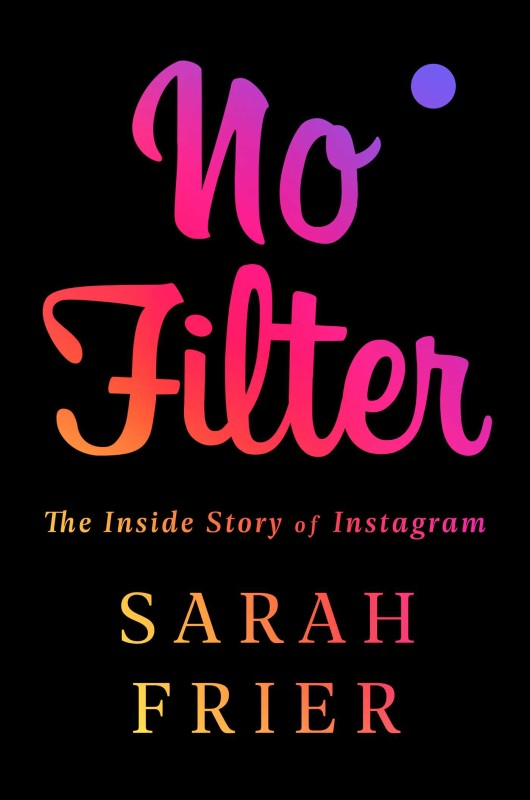

# No filter - The inside story of Instagram

## Synopsis
Since its creation in 2010, Instagram’s fun and simple interface has captured our collective imagination, swiftly becoming a way of life. In No Filter: The Inside Story of Instagram, technology reporter Sarah Frier explains how Instagram’s founders married art and technology to overcome skeptics and to hook the public on visual storytelling. At first, Instagram initially attracted artisans, but then the platform exploded in popularity among the masses, creating an entire industry of digital influencers that’s now worth tens of billions of dollars.

Eighteen months after Instagram’s launch and explosive growth, the founders—Kevin Systrom and Mike Krieger—made the gut-wrenching decision to sell the company to Facebook. For most companies, that would be the end of the story; but for Instagram, it was only the beginning. Instagram borrowed some lessons from Facebook and rejected others, until eventually its success stirred tension with Facebook’s CEO Mark Zuckerberg, just as Facebook became embroiled in a string of public crises. Frier unearths the details that led to the cofounders’ departure, bringing to light dramatic moments unknown to the public until now.

At its heart, No Filter draws on unprecedented exclusive access—from the founders of Instagram, as well as employees, executives, and competitors; hedge fund billionaire Ray Dalio; Anna Wintour of Vogue; Kris Jenner of the Kardashian-Jenner empire; and a plethora of influencers, from fashionistas with millions of followers to owners of famous dogs worldwide—to show how Instagram has fundamentally changed the way we communicate, shop, eat, and travel. The book brings readers inside users’ strategies to craft their personal image and fame, explaining how the company’s product decisions have affected the structure of our society. From teenagers to the pope, No Filter tells the captivating story of how Instagram not only created a new industry but also changed our lives.

## Quotes and notes
- Notes are presented as a bullet list

> Quotes are presented as a Markdown quote
They may have some personal notes after them, like this. This is not part of the book, just my thoughts about the quote

Consecutive quotes/notes don't have to be related at all, they may be pages apart

:star: Personal favourites are marked with a star emoji

### Introduction - Introduction to the ultimate influencer
> _Consider that millions of people and brands have more Instagram followers than the New York Times has subscribers. Marketing through these people, who are basically running personal media companies through tastemaking, storytelling, and entertaining, is now a multibillion-dollar industry_

> :star: _By looking at the way commercial spaces, products, and even homes are designed, we can see Instagram's impact, in a way that we can't as easily see the impact of Facebook or Twitter. The San Francisco workspace I'm writing this book in, for example, has its library arranged not according to title or author, but cover color: the decision makes sense when prioritizing Instagram aesthetics over book discovery_

### Chapter 1 - Project Codename
> She worried Systrom would waste his potential if he gave everything up for somebody else's vision

Systrom's mentor from the entrepeneurship program he was attending to at Stanford, about the possibility of him joining Facebook as an early employee (at that point it didn't even had photos; that was the project Systrom was going to lead). It's crazy how turning down such a huge opportunity (building photos support at Facebook) lead to an even bigger opportunity (founding Instagram)

> A higher-quality tool wouldn't necessarily create better art. "You have to learn to love imperfection". [...] More important was the lesson that just because something is more technically complex doesn't mean it's better

- When going back to USA Systrom joined Odeo (a tech startup) as an intern. His mentor was a recent hire called Jack Dorsey (who would later become the CEO of Twitter). It's funny how Kevin Systrom had a really close relationship with the founders of both Facebook and Twitter when the companies were still nothing.

> The team at Odeo was launching a new status update product, called Twttr, pronounced "twitter", with Dorsey as its CEO

> Master's degree in "symbolic systems" - the famous Stanford program for understanding the psychology of how humans interact with computers 
Sounds super interesting. More info: https://symsys.stanford.edu/

> Systrom thought of how scary it must have been for the team at Odeo to switch to building Twitter, but clearly that had been the right decision. What was their Twitter?

> [...] to ask first what problem they were solving, and then try to solve it in the simplest way possible.

> Systrom's argument to Dorsey, that the trendy HTML5 coding language would be a helpful differentiator in the marketplace, turned out to be wrong. They would have to make the app useful first, and add Android later, if they were lucky enough to become that popular

> Rise nor the founders thought there was a downside to the fact that filters, when used en masse, would give Instagrammers permission to present their reality as more interesting and beautiful than it actually was. That was exactly what would help make the product popular. Instagram posts would be art, and art was a form of commentary on life. The app would give people the gift of expression, but also escapism

> "It's so much work to tweet. There's a lot of pressure about what you're going to say. But it's so easy to post a photo"

> Instagram's early popularity was less about the technology and more about the psychology - about how it made people feel. The filters made reality look like art. And then, in cataloging that art, people would start to think about their lives differently, and themselves differently, and their place in society differently

> :star: Systrom wasn't as confident as he sounded. He had actually been nervous to meet Crowley, since Foursquare was the talk of the industry. Instagram's infrastructure was still struggling to support all the new users. He and Krieger weren't sleeping well. There were plenty of strong competitors. But pretending things were going more smoothly than they actually were was part of the job of being a startup CEO. Everyone needed to think you were on the right track. His posturing was perhaps analogous to the modern pressure Instagram would introduce - the pressure to post only the best photos, making life seem more perfect than it actually was.

### Chapter 2 - The Chaos of Success
> It was better to start with something minimalist, and then let priorities reveal themselves as users ran into trouble

> :star: Krieger, who owned much less of Instagram than Systrom did (40% vs 10%) embraced the hierarchy. He didn't want Systrom's job, and Systrom didn't want his. That's why it worked

> Only they could make that happen. "Other people won't always be in this for us". Systrom realized. They could trust each other, and that was basically it. Nobody else was going to have Instagram's best interests in mind.

Kevin Systrom after Andreesen-Horowitz, one of their investors, invested in a rival company too. 

> :star: "Kevin, let Bieber invest, or pay him for his content. Or else he'll stop using Instagram.
> Systrom had already decided that Instagram wouldn't be paying anyone for their content, since he wanted everyone to be spending time on Instagram because it was fun and useful, not for commercial reasons. He said no to paying Bieber or taking his investment.
> Bieber followed his agent's threat. But his on-and-off girlfriend, Selena Gomez, loved to use Instagram [...]. Soon Bieber was back on the app, continuing to overload the infrastructure, to the point where the company had to devote half a server just to his account activity. 

About Bieber asking for money to use Instagram and Systrom's rejection. It's specially impressive because when Bieber joined the app, Instagram experienced his fastest growth rate ever and his activity had a huge effect on the community, to the point where most of the time Bieber posted a picture the servers went down because of the huge amount of traffic interacting with it (liking/commenting)

### Chapter 3 - The surprise
> :star: He'd never done a deal this big and his nerves were getting to him

Amin Zounfonoun, Facebook's deals director, when the Instagram deal was about to be closed and the price had been decided. I love this quote because you would usually think that a high-level executive is super confident in everything that he does and always has everything under control, but here we can see him worried and having a bad time because of the responsibility. **If even someone so clearly prepared suffers Imposter's Syndrome, how I'm not going to have it too?**

> :star: "If we don't create the thing that kills Facebook, someone else will. The internet is not a friendly place. Things that don't stay relevant don't even get the luxury of leaving ruins. They disappear"

One of the pages of the Facebook employee handbook, explaining Zuckerberg's paranoid leadership.

> [When he learned that Instagram had been sold to Facebook instead of Twitter] Jack Dorsey deleted the Instagram app and stopped posting altogether

Even founders of huge companies get personally affected by business moves. Sometimes they seem to be immune to all that stuff, but things like this prove that's not the case at all. They are also humans after all.

> [When the Instagram deal was announced] That day, Zuckerberg had postead a picture of Beast (his dog) on Instagram. His first time sharing on the app in almost a year

Small details
