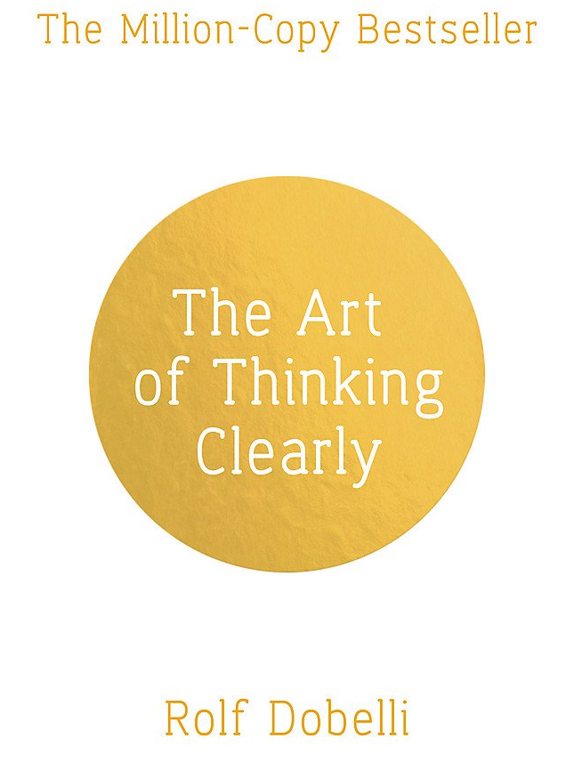

# The Art of Thinking Clearly

The Art of Thinking Clearly by world-class thinker and entrepreneur Rolf Dobelli is an eye-opening look at human psychology and reasoning — essential reading for anyone who wants to avoid “cognitive errors” and make better choices in all aspects of their lives.

Have you ever: Invested time in something that, with hindsight, just wasn’t worth it? Or continued doing something you knew was bad for you? These are examples of cognitive biases, simple errors we all make in our day-to-day thinking. But by knowing what they are and how to spot them, we can avoid them and make better decisions.

Simple, clear, and always surprising, this indispensable book will change the way you think and transform your decision-making—work, at home, every day. It reveals, in 99 short chapters, the most common errors of judgment, and how to avoid them.